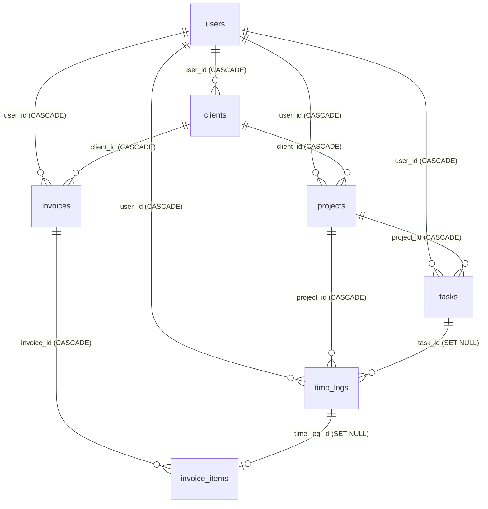

# FreelanceFlow - Comprehensive Project Documentation
*A Premium SaaS Project Management & Invoicing Tool for Freelancers with a Developer Super Admin CRM*

---

## 1. Project Overview

**FreelanceFlow** is a modern, high-performance, full-stack Software-as-a-Service (SaaS) application designed specifically for freelancers to manage their client workflows, track billable hours, schedule tasks, and generate professional PDF invoices. 

Additionally, FreelanceFlow contains a **Super Admin CRM Panel** built for the developer company to monitor platform-wide activity, inspect customer data, modify plan tiers, and manage user registrations in an excel-grid style layout.

---

## 2. Target Audience & System Architecture

The application serves two distinct user roles:

### A. Freelancers (Customers)
Individual developers, designers, writers, and consultants who need to:
- Monitor their active financials (total billed, unpaid invoices, hourly tasks).
- Track project time logs using a persistent stopwatch that runs across pages.
- Handle clients under a freemium model (up to 2 clients for Free, unlimited for Pro).
- Generate and download PDF invoices for clients.

### B. Developer Company (Super Admin)
The creators and operators of FreelanceFlow. The Super Admin panel is a full-width dashboard designed to inspect and manage the entire platform's metrics:
- Platform usage stats (total clients, projects, and invoices created across all users).
- Account breakdown (free trial vs. paid pro users) and revenue tracking.
- Customer management capabilities: edit client profiles, manually upgrade/downgrade subscription plans, override passwords, or permanently delete accounts (with cascading clean-up of their data).

---

## 3. Technology Stack

FreelanceFlow is structured as a decoupled web application consisting of a backend REST API and a frontend Single Page Application (SPA).

| Layer | Technology | Purpose |
| :--- | :--- | :--- |
| **Backend Core** | Node.js (v18+) & Express | Core application server and RESTful routing |
| **Database** | MySQL (XAMPP / Local) | Relational storage for user accounts, timers, and invoices |
| **DB Access** | `mysql2` Connection Pool | High-performance async/await query execution |
| **Authentication** | JWT (JSON Web Tokens) & `bcryptjs` | Secure stateless sessions, route protection, and password hashing |
| **Frontend Core** | React.js (Vite) | Quick loading, component-based user interface |
| **Styling** | Tailwind CSS & Vanilla CSS | Modern utility classes, customized theme palettes, and responsiveness |
| **Data Visuals** | Recharts | Interactive SVG chart rendering for freelancer financial reports |
| **PDF Generation** | jsPDF | Client-side creation and download of billing invoices |
| **Notifications** | react-hot-toast | Sleek, non-blocking toast alert notifications |

---

## 4. Database Schema

The relational database schema is configured in `backend/database/schema.sql` with foreign keys set to `ON DELETE CASCADE` or `ON DELETE SET NULL` to guarantee database integrity.



### Table Definitions

#### 1. `users`
Stores account profiles of registered freelancers.
- `id` (INT, Primary Key, Auto Increment)
- `name` (VARCHAR(100), Not Null)
- `email` (VARCHAR(150), Unique, Not Null)
- `password_hash` (VARCHAR(255), Not Null)
- `plan` (ENUM('free', 'pro'), Default 'free')
- `avatar_color` (VARCHAR(7), Default '#4F46E5')
- `expertise` (VARCHAR(500), Nullable)
- `created_at` / `updated_at` (DATETIME)

#### 2. `clients`
Represents the companies/clients added by a freelancer.
- `id` (INT, Primary Key)
- `user_id` (INT, Foreign Key referencing `users(id)` ON DELETE CASCADE)
- `name` (VARCHAR(100))
- `email` / `phone` / `company` / `address` / `notes`
- `hourly_rate` (DECIMAL(10,2), Default 0.00)
- `currency` (VARCHAR(5), Default 'INR')

#### 3. `projects`
Projects created under clients.
- `id` (INT, Primary Key)
- `user_id` (INT, Foreign Key referencing `users(id)` ON DELETE CASCADE)
- `client_id` (INT, Foreign Key referencing `clients(id)` ON DELETE CASCADE)
- `name` (VARCHAR(150))
- `status` (ENUM('active', 'on_hold', 'completed', 'cancelled'))
- `billing_type` (ENUM('hourly', 'fixed'))
- `budget` (DECIMAL(12,2))

#### 5. `tasks`
Individual tasks linked to a project.
- `id` (INT, Primary Key)
- `project_id` (INT, Foreign Key ON DELETE CASCADE)
- `user_id` (INT, Foreign Key ON DELETE CASCADE)
- `title` (VARCHAR(200))
- `status` (ENUM('todo', 'in_progress', 'review', 'done'))
- `priority` (ENUM('low', 'medium', 'high', 'urgent'))

#### 6. `time_logs`
Records actual time spent working on projects.
- `id` (INT, Primary Key)
- `user_id` (INT, Foreign Key ON DELETE CASCADE)
- `project_id` (INT, Foreign Key ON DELETE CASCADE)
- `task_id` (INT, Foreign Key ON DELETE SET NULL)
- `start_time` / `end_time` (DATETIME)
- `duration_minutes` (INT, Generated virtual column)
- `amount` (DECIMAL(12,2), Virtual calculation based on hourly rate)
- `is_billed` (TINYINT(1), Default 0)

#### 7. `invoices`
Invoices generated for billing.
- `id` (INT, Primary Key)
- `user_id` (INT, Foreign Key ON DELETE CASCADE)
- `client_id` (INT, Foreign Key ON DELETE CASCADE)
- `invoice_number` (VARCHAR(30), Unique)
- `status` (ENUM('draft', 'sent', 'paid', 'overdue', 'cancelled'))
- `subtotal` / `tax_rate` / `tax_amount` / `total` (DECIMAL)

---

## 5. Key Freelancer Features

1. **Dashboard Analytics**: Displays active summaries including total billed invoices, paid earnings, unpaid amounts, and active project distributions. Uses interactive charts to map monthly revenues.
2. **Persistent Stopwatch**: A time-tracker located in the Sidebar footer. It continues ticking uninterrupted during navigation across pages and retrieves active tracking states upon page refresh by using localStorage hooks.
3. **Freemium Limits Check**: Users on the Free Tier can create a maximum of 2 clients. Creating more prompts them to upgrade, enforcing a monetization loop.
4. **Three-step Billing Wizard**: 
   - Step 1: Select client and auto-populate all unbilled time logs.
   - Step 2: Configure line items, hourly details, taxes (default 18%), and invoice numbers.
   - Step 3: Preview the draft, set status, and export as a PDF directly to the local filesystem.

---

## 6. Super Admin CRM Panel (For Developer Company)

The Super Admin View is an integrated CRM dashboard that is accessed by logging in with administrative credentials. It provides the developer company with complete platform intelligence.

### Global Statistics & Platform Metrics
Provides aggregated summaries counting overall activity across all customer accounts:
- **Total Customers**: The sum of all registered platform users.
- **Free Trial Accounts**: Total users on the unpaid model.
- **Paid Pro Accounts**: Total users upgraded to the Pro level.
- **Revenue Collected**: Dynamic SaaS revenue calculation based on active Pro plan users (₹999/mo).
- **Platform Integrity Metrics**: Aggregates of all **Client Profiles**, **Projects managed**, and **Invoices billed** across the database.

### Customer Directory (Excel Grid View)
A full-screen responsive table displaying granular information:
1. **Name & Email**: User account credentials.
2. **Password (Hashed)**: Cryptographic hashes of customer passwords (truncated with copy-to-clipboard functionality to maintain clean visual heights).
3. **Plan Tier**: Labeled badge indicating subscription status (Free vs. Pro).
4. **Registered Date**: Timestamp of user creation.
5. **Activity Counters**: Individual counts of Clients, Projects, and Invoices created by that specific customer.

### User Management Actions
- **Edit Details**: A modal popup to update a customer's name, email, plan tier, professional expertise, or overwrite/update their account password.
- **Delete Account**: Safe deletion triggers that execute database cascades. Deleting a user automatically removes all their clients, projects, tasks, time logs, and invoices from the system, keeping the database clean.

---

## 7. Installation & Local Setup

### System Requirements
- Node.js installed (v18.0.0 or higher)
- NPM (v9.0.0 or higher)
- XAMPP or local MySQL Server running on port 3306

### Step-by-Step Setup

#### 1. Setup MySQL Database
1. Open XAMPP Control Panel and start **Apache** and **MySQL**.
2. Visit [http://localhost/phpmyadmin](http://localhost/phpmyadmin) in your web browser.
3. Click **New** in the sidebar to create a new database.
   - Database Name: `freelanceflow`
   - Collation: `utf8mb4_unicode_ci`
4. Click on the `freelanceflow` database, navigate to the **SQL** tab.
5. Open the project folder on your computer and view the contents of the database setup file: `backend/database/schema.sql`. Copy all the code inside.
6. Paste the SQL query inside the SQL tab on phpMyAdmin, and click **Go** to create the tables.

#### 2. Configure Backend Server
1. Navigate to the backend folder inside your terminal:
   ```bash
   cd backend
   ```
2. Install npm dependencies:
   ```bash
   npm install
   ```
3. Configure settings inside the environment file `backend/.env`:
   ```env
   PORT=5000
   DB_HOST=localhost
   DB_PORT=3306
   DB_USER=root
   DB_PASSWORD=
   DB_NAME=freelanceflow
   JWT_SECRET=freelanceflow_jwt_super_secret_2026_change_this
   JWT_EXPIRES_IN=7d
   ```
4. Start backend in development mode (launches server on port `5000` with hot-reloads):
   ```bash
   npm run dev
   ```

#### 3. Configure Frontend App
1. Open a new terminal tab and navigate to the frontend folder:
   ```bash
   cd frontend
   ```
2. Install dependencies:
   ```bash
   npm install
   ```
3. Verify settings inside `frontend/.env`:
   ```env
   VITE_API_URL=http://localhost:5000/api
   ```
4. Start Vite web development server (typically launches on port `5173` or `3000`):
   ```bash
   npm run dev
   ```
5. Open your browser and navigate to the local URL (e.g. `http://localhost:5173`) to view FreelanceFlow.
